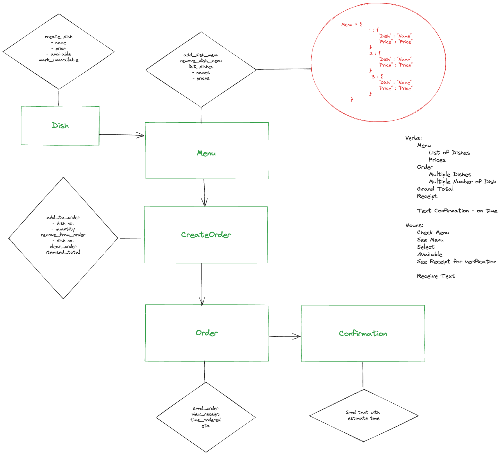

# File: design.md

# x Multi-Class Planned Design Recipe

## 1. Describe the Problem

_Put or write the user story here. Add any clarifying notes you might have._

> As a customer 
> So that I can check if I want to order something 
> I would like to see a list of dishes with prices. 

> As a customer
> So that I can order the meal I want
> I would like to be able to select some number of several available dishes.

> As a customer
> So that I can verify that my order is correct
> I would like to see an itemised receipt with a grand total.

> As a customer
> So that I am reassured that my order will be delivered on time
> I would like to receive a text such as "Thank you! Your order was placed and will be delivered before 18:52" after I have ordered.
 
* Create Dish Feature
* Menu Feature - add/remove dish, list menu
* Create Order Feature - add quantity to order, remove from order, clear order, current order total, process order
* Order Feature - send_order, view receipt, time ordered
* Confirmation Feature - uses Twillio API to send confirmation text
 
## 2. Design the Class System

_Consider diagramming out the classes and their relationships. Take care to focus on the details you see as important, not everything._

_Also design the interface of each class in more detail._
'''python
# EXAMPLE 

#   class CreateOrder():
        def add_to_order(self, dish, quantity):
        #   Parameters:
        #       A dish from the menu, and quantity.
        #   Side-effects:
        #       Dish and quantity are added to current order.
        pass

        def remove_from_order(self, dish):
        #   Parameters:
        #       A dish from the menu
        #   Side-effects:
        #       The dish (all quntity) is removed from the current order
        pass

        def clear_order(self):
        #   Side-effects:
        #       All dishes removed from current order
        pass

        def itemised_total(self):
        #   Returns:
        #       List of current dishes added to order, their prices, and total cost of order so far
        pass

#   class MenuCreator():
        def add_dish_menu(self, dish):
        #   Parameters:
        #       An instance of the Dish class
        #   Side-effects:
        #       Dish is added to menu dictionary.
        pass

        def remove_dish_menu(self, dish):
        #   Parameters:
        #       An instance of the Dish class
        #   Side-effects:
        #       Dish is removed from the menu dictionary.

        def display_menu(self):
        #   Returns:
        #       Menu in List or dictionary form

#   class DishCreator():
        def __init__(self, dish, price):
        #   Parameters:
        #       A dish name as a string, a price as a float
        #   Side-effects:
        #       Available property constructed as equal to True

        def mark_unavailable(self):
        #   Side-effects:
        #       Sets Available property to False

#   class Orderer():
        def __init__(self, sent_order, time):
        #   Parameters:
        #       An instance of the CreateOrder class
        #       Time of instance
        #   Side-effect:
        #       Created order is added to sent_order
        pass

        def view_receipt(self):
        #   Returns:
        #       lists itemised view of order with total cost
        pass

        def eta(self):
        #   Returns:
        #       eatimated time of order arrival
        pass

#   class ConfirmationSender():
        def __init__(self, order):
        #   Parameters:
        #       An instnace of a sent order

        def send_confirmation(self):
        #   Side-effects:
        #       Confirmation message as a string, sent as a text, with eta.
        pass
'''

## 3. Create Examples as Integration Tests

_Create examples of the classes being used together in different situations and combinations that reflect the ways in which the system will be used._
'''python
# EXAMPLE 

'''

_Create examples, where appropriate, of the behaviour of each relevant class at a more granular level of detail._
'''python
# EXAMPLE 

'''

_Encode each example as a test. You can add to the above list as you go._

## 4. Implement the Behaviour

_After each test you write, follow the test-driving process of red, green, refactor to implement the behaviour._